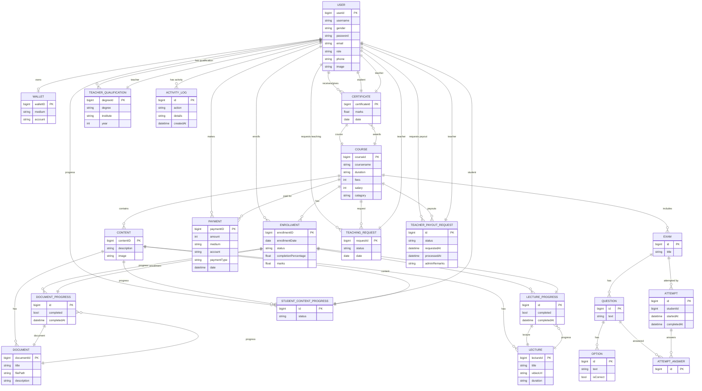

```mermaid
erDiagram

    USER {
        bigint userid PK
        string username
        string gender
        string password
        string email
        string role
        string phone
        string image
    }
    ENROLLMENT {
        bigint enrollmentID PK
        date enrollmentDate
        string status
        float completionPercentage
        float marks
    }
    COURSE {
        bigint courseid PK
        string coursename
        string duration
        int fees
        int salary
        string catagory
    }
    CONTENT {
        bigint contentID PK
        string description
        string image
    }
    LECTURE {
        bigint lectureId PK
        string title
        string videoUrl
        string duration
    }
    DOCUMENT {
        bigint documentId PK
        string title
        string filePath
        string description
    }
    DOCUMENT_PROGRESS {
        bigint id PK
        bool completed
        datetime completedAt
    }
    LECTURE_PROGRESS {
        bigint id PK
        bool completed
        datetime completedAt
    }
    STUDENT_CONTENT_PROGRESS {
        bigint id PK
        string status
    }
    PAYMENT {
        bigint paymentID PK
        int amount
        string medium
        string account
        string paymentType
        datetime date
    }
    WALLET {
        bigint walletID PK
        string medium
        string account
    }
    CERTIFICATE {
        bigint certificateId PK
        float marks
        date date
    }
    EXAM {
        bigint id PK
        string title
    }
    QUESTION {
        bigint id PK
        string text
    }
    OPTION {
        bigint id PK
        string text
        bool isCorrect
    }
    ATTEMPT {
        bigint id PK
        bigint studentId
        datetime startedAt
        datetime completedAt
    }
    ATTEMPT_ANSWER {
        bigint id PK
    }
    TEACHER_QUALIFICATION {
        bigint degreeId PK
        string degree
        string institute
        int year
    }
    TEACHING_REQUEST {
        bigint requestId PK
        string status
        date date
    }
    TEACHER_PAYOUT_REQUEST {
        bigint id PK
        string status
        datetime requestedAt
        datetime processedAt
        string adminRemarks
    }
    ACTIVITY_LOG {
        bigint id PK
        string action
        string details
        datetime createdAt
    }

    USER ||--o{ ENROLLMENT : enrolls
    USER ||--o{ PAYMENT : makes
    USER ||--o| WALLET : owns
    USER ||--o{ TEACHER_QUALIFICATION : "has qualification"
    USER ||--o{ TEACHING_REQUEST : "requests teaching"
    USER ||--o{ TEACHER_PAYOUT_REQUEST : "requests payout"
    USER ||--o{ CERTIFICATE : "receives/gives"
    USER ||--o{ ACTIVITY_LOG : "has activity"
    USER ||--o{ STUDENT_CONTENT_PROGRESS : "progress"
    COURSE ||--o{ ENROLLMENT : "has"
    COURSE ||--o{ CONTENT : "contains"
    COURSE ||--o{ EXAM : "includes"
    COURSE ||--o{ CERTIFICATE : "awards"
    COURSE ||--o{ TEACHER_PAYOUT_REQUEST : "payouts"
    COURSE ||--o{ TEACHING_REQUEST : "request"
    COURSE ||--o{ PAYMENT : "paid for"
    CONTENT ||--o{ LECTURE : "has"
    CONTENT ||--o{ DOCUMENT : "has"
    CONTENT ||--o{ STUDENT_CONTENT_PROGRESS : "progress"
    ENROLLMENT ||--o{ DOCUMENT_PROGRESS : "progress"
    ENROLLMENT ||--o{ LECTURE_PROGRESS : "progress"
    EXAM ||--o{ QUESTION : "has"
    EXAM ||--o{ ATTEMPT : "attempted by"
    QUESTION ||--o{ OPTION : "has"
    QUESTION ||--o{ ATTEMPT_ANSWER : "answered"
    ATTEMPT ||--o{ ATTEMPT_ANSWER : "answers"
    DOCUMENT ||--o{ DOCUMENT_PROGRESS : "progress"
    LECTURE ||--o{ LECTURE_PROGRESS : "progress"
    TEACHER_QUALIFICATION ||--|| USER : "teacher"
    TEACHING_REQUEST ||--|| USER : "teacher"
    TEACHER_PAYOUT_REQUEST ||--|| USER : "teacher"
    CERTIFICATE ||--|| USER : "student"
    CERTIFICATE ||--|| USER : "teacher"
    CERTIFICATE ||--|| COURSE : "course"
    STUDENT_CONTENT_PROGRESS ||--|| USER : "student"
    STUDENT_CONTENT_PROGRESS ||--|| CONTENT : "content"
    DOCUMENT_PROGRESS ||--|| ENROLLMENT : "enrollment"
    DOCUMENT_PROGRESS ||--|| DOCUMENT : "document"
    LECTURE_PROGRESS ||--|| ENROLLMENT : "enrollment"
    LECTURE_PROGRESS ||--|| LECTURE : "lecture"
```